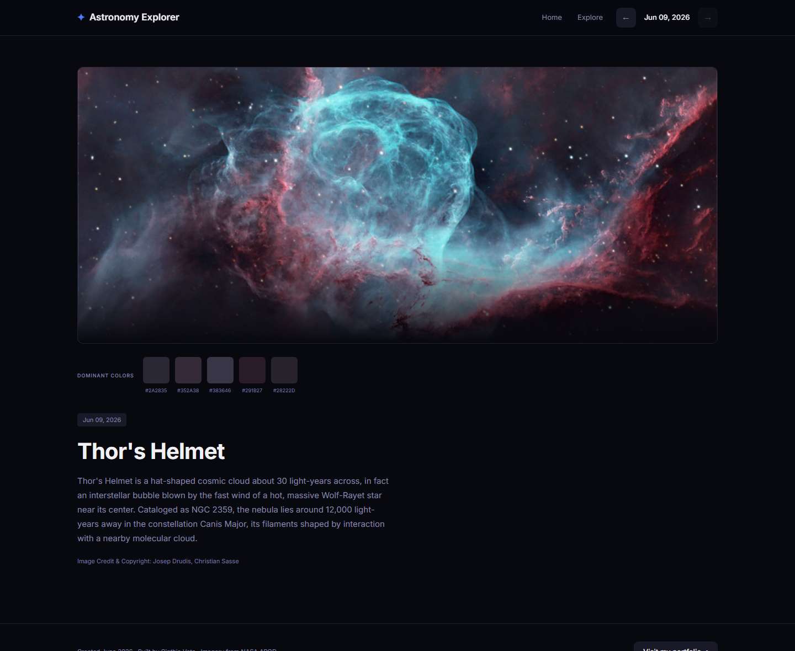

# Astronomy Picture Explorer

Explore NASA's **Astronomy Picture of the Day (APOD)** in a fast, accessible web
app: browse the picture of the day, step through the archive by date, watch video
entries, and see a color palette extracted live from each image — right in the
browser.

🔭 **Live demo:** https://astronomy-picture-explorer.netlify.app/



---

## What it does (Stage 1)

- **Picture of the day** — a hero view with the image, title, date and the full
  description, plus image credit.
- **Explore by date** — a keyboard-friendly date picker and a header stepper to
  move through the archive; the view updates instantly.
- **Image *and* video entries** — when an entry is a video, the card shows a
  thumbnail and a link to watch it (no embedded players).
- **Live color palette** — the dominant colors of each image are computed in the
  browser from the picture's pixels and shown as swatches with their hex codes.
- **Accessible & responsive** — descriptive alt text, keyboard navigation, focus
  styles, WCAG AA color contrast, and a layout tuned from mobile to desktop.

## Why it exists

A portfolio piece built around a real, recognizable data source. The goal is a
small but production-quality front end: a clean component architecture, a design
implemented faithfully from Figma, in-browser image processing, and accessibility
treated as a first-class concern rather than an afterthought.

## Tech stack

- **Angular 19** — standalone components and **Signals** for state (no NgModules).
- **Tailwind CSS v4** — design implemented from Figma using named design tokens.
- **Canvas API** — dominant-color extraction performed entirely client-side, with
  no third-party color libraries.
- **TypeScript**, unit tests with **Karma + Jasmine**.
- **Netlify** — static hosting and continuous deploys.

## How it works

The app reads a local JSON dataset that mirrors the shape of NASA's real APOD API,
so the data layer can later be pointed at a live backend without changing the UI.
A small service exposes the selected date and the current entry as signals, and the
views react to those. For the palette, each image is drawn to an off-screen canvas
and its pixels are sampled and grouped into the most dominant colors; if the pixels
can't be read it falls back to a fixed brand palette.

## Roadmap

- **Stage 1 — this app:** picture of the day, explore by date, palette, video. ✅
- **Stage 2:** favorites (saved locally) and keyword search.
- **Stage 3:** a real backend (NASA API + database) replacing the mock dataset.

## Run it locally

```bash
npm install
npm start        # dev server at http://localhost:4200
npm run build    # production build
npm test         # unit tests
```

## Credits

- Imagery and descriptions: **NASA Astronomy Picture of the Day** (apod.nasa.gov).
- Built by **[Cinthia Vota](https://cinthiavota.com.ar/)**.
