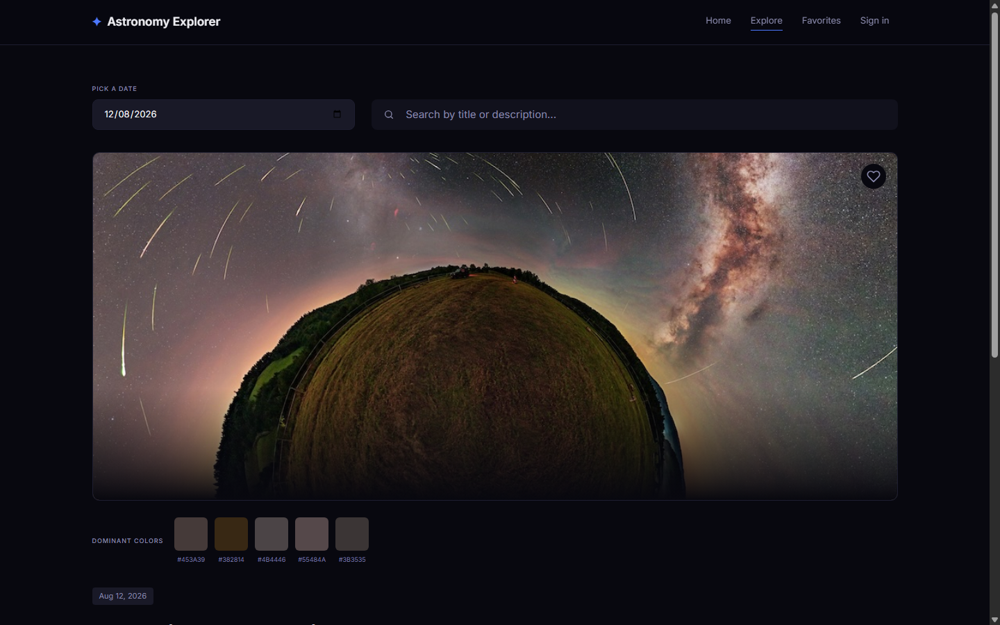
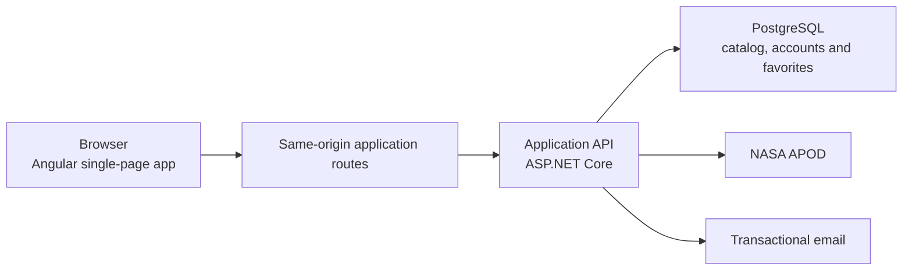

# Astronomy Picture Explorer

[Open the live demo](https://astronomy-picture-explorer.netlify.app/)

Astronomy Picture Explorer is a responsive portfolio application for discovering
NASA's Astronomy Picture of the Day (APOD). It pairs a focused Angular interface
with an application-owned API, searchable catalog and optional account features
for saving personal favorites.



_Anonymous desktop capture of the public production Explorer view, taken on
2026-08-12. It uses an APOD date available at capture time and contains no account
or provider data._

## What visitors can do

- View the current Astronomy Picture of the Day on Home.
- Choose an APOD date in Explorer, including image and video entries.
- Search the prepared catalog by title or explanation without case-sensitive input.
- Inspect a palette sampled from each displayed image directly in the browser.
- Create an account, confirm its email, recover a password and save APOD entries to
  a private favorites list.
- Use the experience with keyboard focus, descriptive image text and responsive
  desktop/mobile navigation.

The app handles loading, empty and retry states deliberately, so a visitor can
understand when an upstream image or the search catalog is temporarily unavailable.

## How it works


```mermaid
flowchart LR
    Browser["Browser<br/>Angular single-page app"]
    Routes["Same-origin application routes"]
    Api["Application API<br/>ASP.NET Core"]
    Database["PostgreSQL<br/>catalog, accounts and favorites"]
    Nasa["NASA APOD"]
    Email["Transactional email"]

    Browser --> Routes --> Api
    Api --> Database
    Api --> Nasa
    Api --> Email
```

The browser talks only to the application's public routes. The API retrieves an
APOD entry when needed, keeps reusable catalog data in PostgreSQL, and associates
saved entries with the signed-in account. Search uses PostgreSQL full-text search
across APOD titles and explanations. Email confirmation and password recovery are
delivered through a transactional email service.

Operational credentials and deployment configuration are intentionally kept out of
the repository and out of the browser bundle.

## Stack

- **Angular 22** with standalone components and Signals
- **Tailwind CSS v4**, TypeScript, Karma and Jasmine
- **Canvas API** for client-side color palette extraction
- **ASP.NET Core on .NET 10** with ASP.NET Core Identity
- **PostgreSQL** with full-text search for the APOD catalog
- **Docker Compose** for a reproducible local stack
- **NASA APOD** for astronomy imagery and descriptions

## Run locally

### Frontend development

Install a Node.js version supported by Angular 22, then run:

```bash
npm ci
npm start
```

Open `http://localhost:4200`. The development server expects the local API when
calling application routes.

### Full local stack

Docker Desktop is required for the full stack. The supplied Compose setup uses local
fixtures and a local email log, rather than production services.

1. Copy `.env.example` to `.env` and create the local-only secret files it references
   with your own development values. Do not commit either `.env` or `.secrets/`.
2. Validate and start the stack:

   ```powershell
   docker compose config
   docker compose up -d --build
   ```

3. Open `http://localhost:8080`.

Use `docker compose down` to stop the local stack. The more detailed
[local runbook](docs/deploy/p3-local-runbook.md) explains the local fixtures and
cleanup options.

## Deployment note

The public demo runs on free-tier infrastructure. After a period without traffic,
the first request can take longer while the service starts. Retrying once is normally
enough; no visitor setup is required.

## Credits and usage

- APOD imagery, descriptions and individual credits are provided by
  [NASA Astronomy Picture of the Day](https://apod.nasa.gov/). Their use remains
  subject to NASA's guidance and to any credit shown with an individual entry.
- Product design and implementation: [Cinthia Vota](https://cinthiavota.com.ar/).
- This repository does not currently include a separate open-source license. The
  source is presented as a portfolio project; do not assume reuse rights where none
  are stated.
