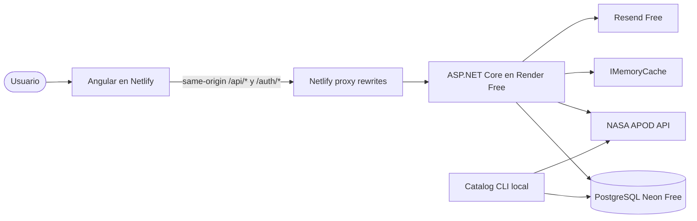
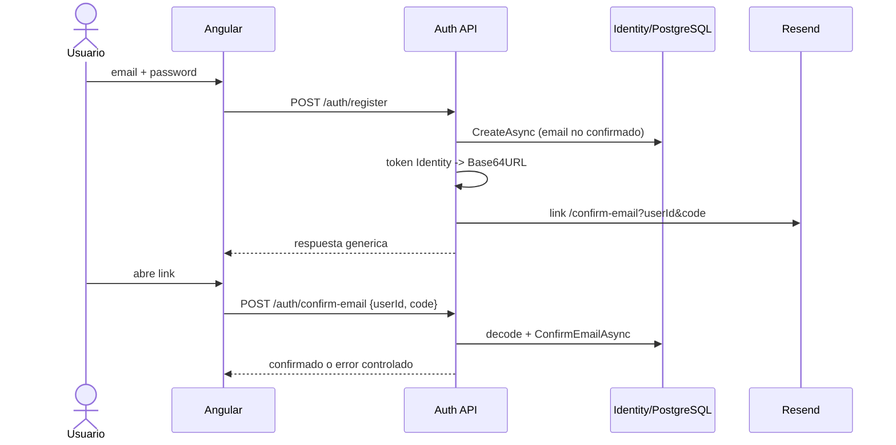
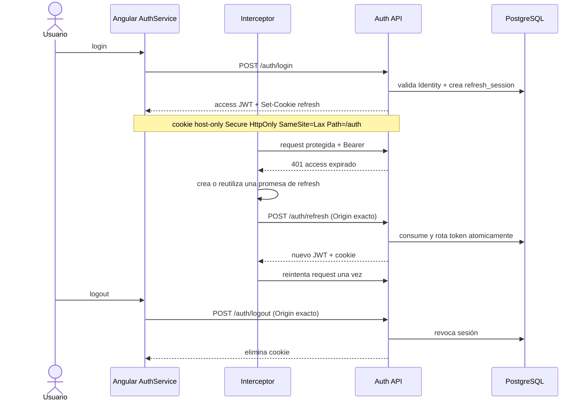
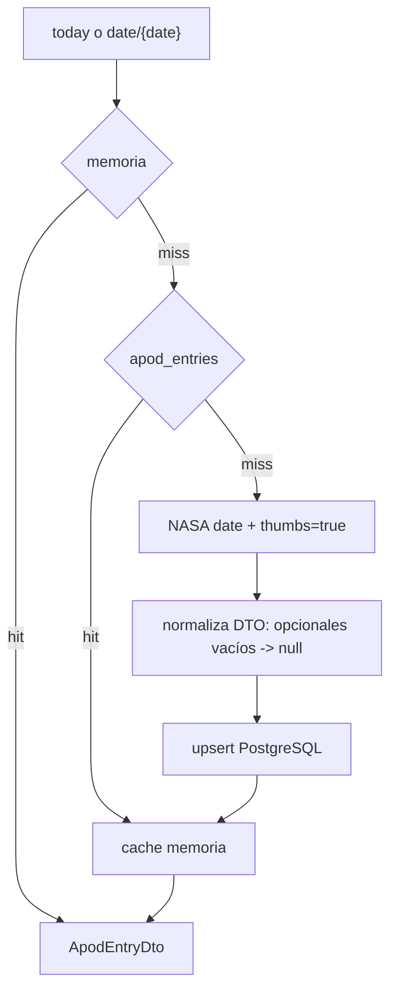
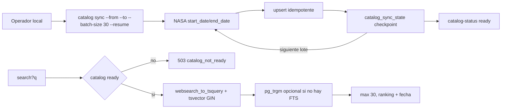
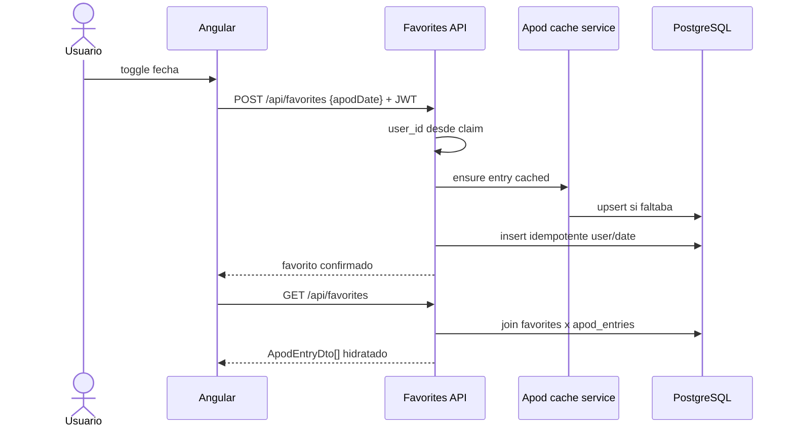
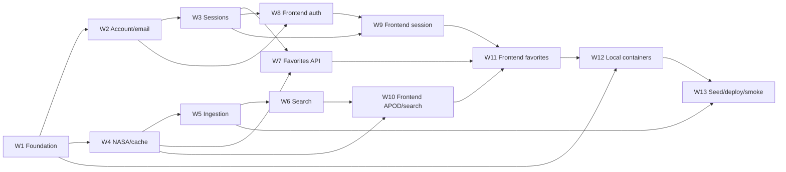

# P3 - Panorama de flujos, arquitectura y datos

Date: 2026-07-16
Status: P3 IN PROGRESS - W1 foundation + W2 account/email implemented
Source: ADR-0003 + `docs/plans/astronomy-p3-backend-plan.md`

Este documento une la propuesta de P3 en un mapa operativo. Los contratos normativos
viven en ADR-0003; las unidades de ejecucion viven en las waves W1-W13.

## 1. Contexto del sistema



Reglas de frontera:

- El navegador nunca recibe NASA/Resend/DB secrets.
- Las llamadas de navegador se mantienen same-origin; la API Render directa no es el
  contrato publico de la SPA.
- El backfill nunca atraviesa Netlify ni corre en Render.
- Imagenes/video siguen siendo URLs remotas; PostgreSQL guarda solo metadata.
- Ninguna pieza puede escalar automaticamente a un plan pago.

## 2. Navegacion y actores


| Caso | Frontend | Backend | Auth |
|---|---|---|---|
| Imagen del dia | `/home` | `GET /api/apod/today` | No |
| Fecha exacta | `/explorer` | `GET /api/apod/date/{date}` | No |
| Keyword | `/explorer` | `GET /api/apod/search?q=&page=&pageSize=` | No |
| Estado catalogo | estados de Explorer | `GET /api/apod/catalog-status` | No |
| Registro | `/register` | `POST /auth/register` | No |
| Reenvio | Login/Register | `POST /auth/resend-confirmation` | No |
| Confirmacion | `/confirm-email` | `POST /auth/confirm-email` | No |
| Login | `/login` | `POST /auth/login` | No |
| Refresh | bootstrap/interceptor | `POST /auth/refresh` | Cookie + Origin |
| Logout | accion usuario | `POST /auth/logout` | Cookie/JWT + Origin |
| Favoritos | cards + `/favorites` | `/api/favorites` | JWT |

## 3. Registro y confirmacion



Registro/reenvio tienen rate limit y respuestas anti-enumeracion. El link contiene lo
necesario para identificar al usuario, pero la mutacion no se ejecuta con GET.

El key ring que firma los tokens Identity vive en PostgreSQL con application name
estable; por eso un link emitido antes de un restart/cold start sigue validando en una
nueva instancia. Register/resend se limitan separadamente por IP de transporte y por
hash de email normalizado. W13 debe resolver la IP original solo mediante forwarders
verificados de la cadena Netlify -> Render.

## 4. Login, refresh single-flight y logout



Ante refresh fallido se limpia memoria y una sola navegacion lleva a login. Los endpoints
de auth no se auto-reintentan. Reusar un refresh revocado invalida toda su familia.

## 5. APOD por fecha y DTO



Contrato expuesto:

```text
date, title, explanation, media_type, url,
hdurl|null, thumbnail_url|null, copyright|null
```

NASA tambien puede devolver `service_version`, pero es metadata de proveedor y no forma
parte del DTO de la aplicacion. Search utiliza unicamente titulo y explicacion.

## 6. Ingestion y busqueda



La carga historica se hace una vez desde desarrollo contra Neon. Si se interrumpe, el
checkpoint permite continuar. `today` agrega la entrada actual al catalogo de manera
natural. No hay scheduler ni keepalive.

## 7. Favoritos



DELETE filtra simultaneamente por `user_id` del claim y fecha. Tests con dos usuarios
demuestran que no existe lectura ni borrado cruzado.

## 8. Modelo de datos

```mermaid
erDiagram
    users ||--o{ refresh_sessions : owns
    users ||--o{ favorites : owns
    apod_entries ||--o{ favorites : references

    users {
        uuid id PK
        string email UK
        bool email_confirmed
        string password_hash "Identity-owned"
    }
    refresh_sessions {
        uuid id PK
        uuid user_id FK
        string token_hash UK
        uuid family_id
        uuid replaced_by_token_id
        timestamp expires_at
        timestamp revoked_at
    }
    apod_entries {
        date date PK
        string title
        string explanation
        string media_type
        string url
        string hdurl nullable
        string thumbnail_url nullable
        string copyright nullable
        tsvector search_vector
        timestamp cached_at
    }
    favorites {
        uuid user_id PK,FK
        date apod_date PK,FK
        timestamp created_at
    }
    catalog_sync_state {
        uuid id PK
        date target_from
        date target_to
        date last_completed_date
        string status
        string last_error nullable
    }
```

### W1 physical schema alignment

La migracion inicial implementa el diagrama con estas precisiones:

- Identity conserva sus tablas convencionales user-only; `users` en el diagrama es
  conceptual y `NormalizedEmail` es unico.
- `refresh_sessions.replaced_by_token_id` es una self-FK `NO ACTION`; eliminar usuario
  borra por cascade favoritos y sesiones, mientras eliminar APOD favorito queda
  restringido.
- `search_vector` es generated stored, ponderado A/B e indexado con GIN.
- `catalog_sync_state` es unico por rango y usa status string restringido.
- Fechas usan `date`; instantes usan `timestamp with time zone` y valores UTC.

### W2 account/security alignment

- La segunda migracion agrega `DataProtectionKeys`; no modifica la migracion W1.
- Confirmacion no persiste el token raw: almacena solo el key ring de Data Protection.
- Email/username respetan el limite fisico Identity de 256 caracteres.
- El XML del key ring y la resolucion de IP real conservan gates productivos explicitos
  en W13 antes de habilitar la release.

## 9. Waves y dependencias



## 10. Costo cero y primera visita

- Render puede dormir; Angular muestra `Connecting to the astronomy service...`, espera
  con timeout acotado y ofrece Retry sin borrar el estado del usuario.
- El backfill no consume horas ni trafico de Render.
- Neon escala a cero; el seed verifica tamaño y se detiene ante limites.
- Resend se protege con rate limits y solo se usa para confirmacion.
- No hay keepalive, jobs pagos, cargos por exceso ni upgrade automatico.
- El runbook W13 debe volver a verificar planes/cuotas porque son datos temporales.
