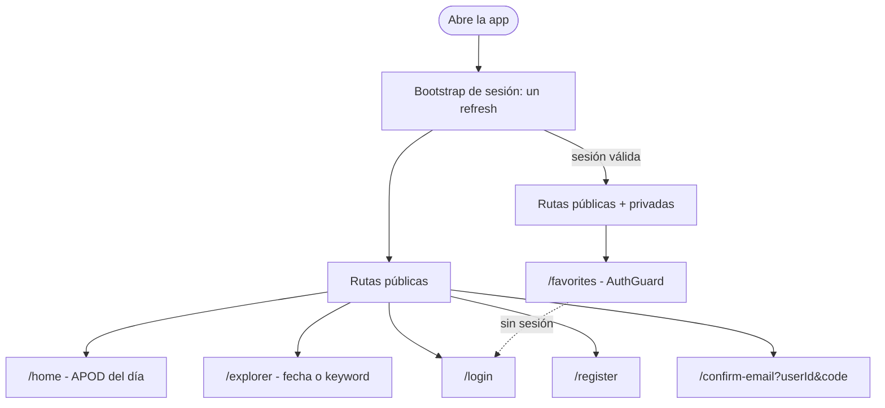
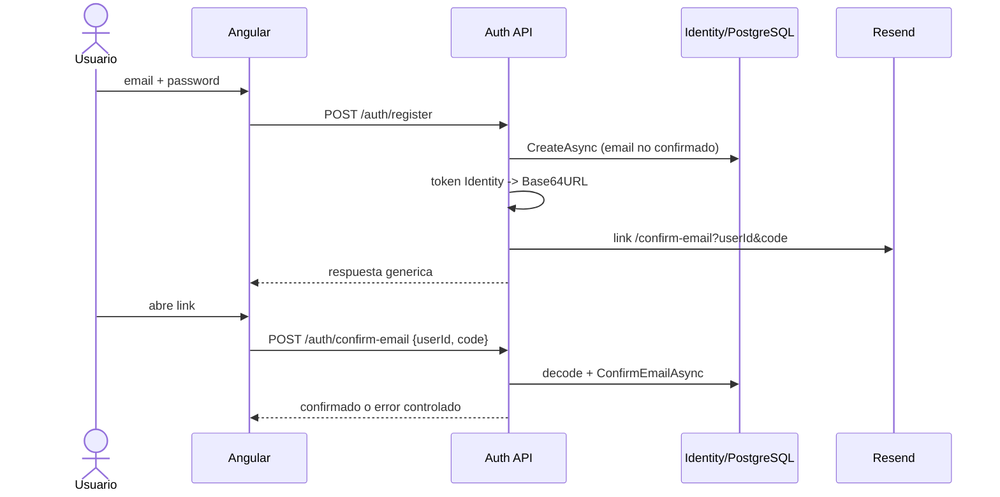
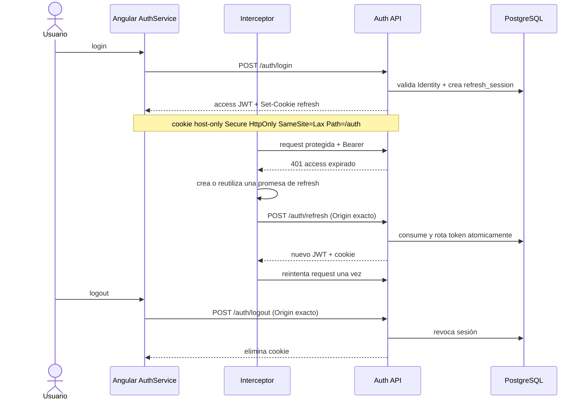
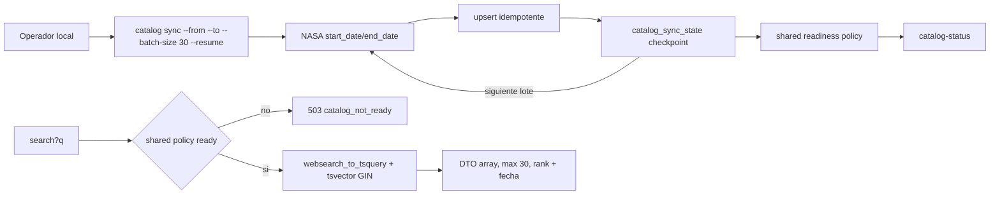
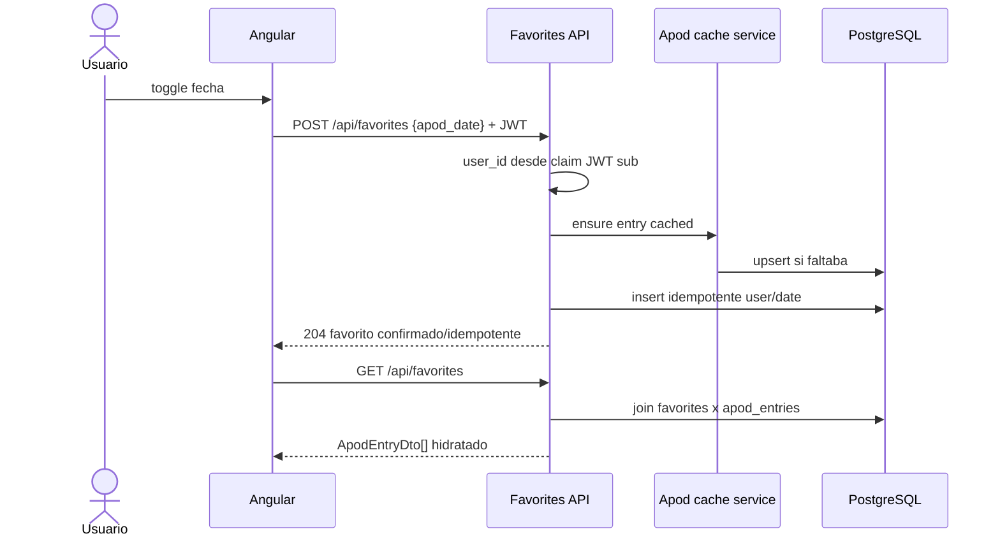
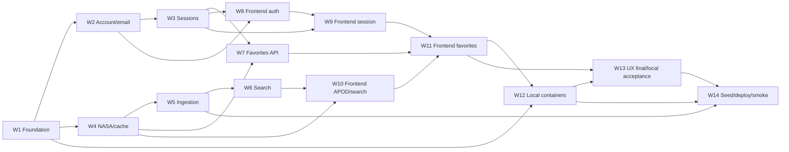
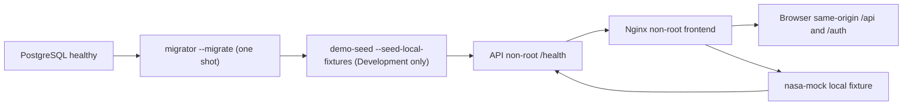

# P3 - Panorama de flujos, arquitectura y datos

Date: 2026-07-22
Status: P3 IN PROGRESS - W1-W12 implemented
Source: ADR-0003 + `docs/plans/astronomy-p3-backend-plan.md`

Este documento une la propuesta de P3 en un mapa operativo. Los contratos normativos
viven en ADR-0003; las unidades de ejecucion viven en las waves W1-W14.

## 1. Contexto del sistema


Reglas de frontera:

- El navegador nunca recibe NASA/Resend/DB secrets.
- Las llamadas de navegador se mantienen same-origin; la API Render directa no es el
  contrato publico de la SPA.
- El backfill nunca atraviesa Netlify ni corre en Render.
- Imagenes/video siguen siendo URLs remotas; PostgreSQL guarda solo metadata.
- Ninguna pieza puede escalar automaticamente a un plan pago.

## 2. Navegacion y actores



| Caso | Frontend | Backend | Auth |
|---|---|---|---|
| Imagen del dia | `/home` | `GET /api/apod/today` | No |
| Fecha exacta | `/explorer` | `GET /api/apod/date/{date}` | No |
| Keyword | `/explorer` | `GET /api/apod/search?q=&page=&pageSize=` | No |
| Estado catalogo | estados de Explorer | `GET /api/apod/catalog-status` | No |
| Registro | `/register` | `POST /auth/register` | No |
| Reenvio | Login/Register | `POST /auth/resend-confirmation` | No |
| Confirmacion | `/confirm-email` | `POST /auth/confirm-email` | No |
| Login | `/login` | `POST /auth/login` | No |
| Refresh | bootstrap/interceptor | `POST /auth/refresh` | Cookie + Origin |
| Logout | accion usuario | `POST /auth/logout` | Cookie + Origin |
| Favoritos | cards + `/favorites` | `/api/favorites` | JWT |

## 3. Registro y confirmacion



Registro/reenvio tienen rate limit y respuestas anti-enumeracion. El link contiene lo
necesario para identificar al usuario, pero la mutacion no se ejecuta con GET.

### W8 frontend account alignment

W8 aporta rutas standalone lazy de registro, login y confirmacion, y un `Sign in` en el
header persistente para que la cuenta se descubra tambien en mobile. `AuthService` mapea
ProblemDetails tipados y conserva el access JWT solo en signals. Login oculta el detalle
de 401 y expone reenvio solo para `403 email_unconfirmed`. Antes del POST de
confirmacion, Angular exige un GUID y un Base64URL y limpia el codigo de la historia;
esto tambien ocurre ante un error. Luego lleva a login sin crear una sesion automatica.

### W9 frontend session alignment

W9 registra un bootstrap que comparte exactamente un refresh same-origin y resuelve
`checking/auth/anon`; una cookie ausente termina anonima sin login redirect. `/favorites`
espera ese resultado y solo redirige a `/login?returnUrl=/favorites`. El interceptor usa
Bearer solo para `/api/*` relativo con token en memoria; los 401 concurrentes comparten
una rotacion y cada original se reintenta una vez mediante un marker `HttpContext` que no
viaja como header. `/auth/*`, URLs externas y retries no entran al ciclo. Fallar refresh
limpia y redirige una sola vez; logout limpia sincronicamente y es best-effort en red.
La generacion capturada con cada Bearer impide que una request/refresh anterior use o
limpie una sesion creada despues del logout. `sessionChange` entrega el usuario
anterior/actual a W11 para evitar favoritos cruzados.
El proxy development lleva `/api` y `/auth` a `localhost:5179`. Login solo consume un
`returnUrl` interno normalizado. W10 puede migrar shell/navegacion APOD, pero debe
mantener un control de cuenta accesible.

El key ring que firma los tokens Identity vive en PostgreSQL con application name
estable; por eso un link emitido antes de un restart/cold start sigue validando en una
nueva instancia. Register/resend se limitan separadamente por IP de transporte y por
hash de email normalizado. W14 debe resolver la IP original solo mediante forwarders
verificados de la cadena Netlify -> Render.

### W10 frontend APOD/search alignment

W10 deja `/home` como ruta canonica y hace que `/` solo redirija. Home consulta
`GET /api/apod/today`; Explorer consulta `GET /api/apod/date/{date}` y search usa
`GET /api/apod/search?q=&page=1&pageSize=12`. El navegador no conserva un archivo
APOD, `availableDates` ni chips. El input nativo acepta `1995-06-16..UTC hoy` y el
stepper suma/resta dias UTC.

El servicio separa `requestedDate` (fecha valida pendiente) de `selectedDate` (fecha
confirmada por la respuesta real) y usa `switchMap` para cancelar date/search obsoletos.
Home y Explorer presentan estados loading, cold-start/upstream, empty y
`catalog_not_ready` con Retry accesible. Esta migracion no mueve JWT ni altera W9.

### W11 frontend favorites alignment

`FavoritesService` toma posesion exclusiva de la coleccion hidratada. Despues de la
sesion W9 hace un unico `GET /api/favorites` por usuario/sesion, por lo que Favorites y
las cards no hacen N+1. Las mutaciones exactas son `POST /api/favorites` con
`{ "apod_date": date }` y `DELETE /api/favorites/{date}`; pending por fecha conserva
`aria-pressed`, evita doble toggle y muestra error/retry recuperable. El cambio de
sesion limpia/cancela estado antes de cargar la siguiente cuenta; lecturas y callbacks
validan el usuario actual, por lo que una respuesta vieja no puede filtrarse ni durante
el intervalo previo al effect Angular. La signal de identidad activa invalida valores
publicos cacheados y deja que B exponga su coleccion al completarse la carga. El corazon
anonimo es un CTA accesible a login con retorno interno
normalizado. La fachada P2, `ape.favorites.v1` y cualquier migracion de favoritos
anonimos dejan de existir.

### W13 final UX and local acceptance alignment

Explorer presenta primero el DatePicker y luego Search; en desktop ambos controles se
alinean por su borde inferior y en mobile conservan ese orden vertical. El stepper de
fecha deja el shell global y vive sobre el extremo derecho de la imagen Home, por lo que
no distrae rutas que no usan esa interacción. Desktop y mobile añaden una línea inferior
fina a la ruta primaria activa, además de color y `aria-current`.

PostgreSQL FTS ya compara sin distinguir mayúsculas/minúsculas. W13 conserva el texto
escrito por la persona y prueba `astronomy`, `ASTRONOMY` y `Astronomy` contra el fixture
local, sin habilitar trigram ni cambiar el ranking. La aceptación de cuenta permanece
local: `401 /auth/refresh` sin cookie representa bootstrap anónimo; `403
email_unconfirmed` muestra reenvío. El enlace efímero se consulta solo en el log local
de API y nunca se expone desde la SPA ni se registra en evidencia.

Después de un login exitoso, la ruta Login deja de renderizar los campos y presenta solo
`Signed in successfully.` como estado transitorio. Luego navega al `returnUrl` interno
normalizado o, en su ausencia, a `/home`; esto evita repetir una acción ya completada
sin romper el retorno desde Favorites.

## 4. Login, refresh single-flight y logout



Ante refresh fallido se limpia memoria y una sola navegacion lleva a login. Los endpoints
de auth no se auto-reintentan. Reusar un refresh revocado invalida toda su familia.

W3 materializa este flujo con JWT HMAC de 10 minutos y refresh opaco de 32 bytes. La DB
solo recibe SHA-256; rotate/logout serializan la familia completa con un advisory lock
transaccional y reconsultan estado despues de adquirirlo. Dos consumos concurrentes
producen un 200 y un 401, y el replay deja toda la familia revocada. Por eso W9 mantiene
single-flight como requisito funcional, aunque el backend tambien falla cerrado.

Refresh/logout validan un unico Origin exacto en Production antes de tocar cookie o DB.
Logout no exige Bearer: una cookie basta incluso si el access token expiro. Login tiene
limiter IP-only para no convertir un partition key email en bloqueo dirigido de cuentas.

## 5. APOD por fecha y DTO

```mermaid
flowchart TD
    REQ["today o date/{date}"] --> MEM{"memoria"}
    MEM -->|hit| OUT["ApodEntryDto"]
    MEM -->|miss| PG{"apod_entries"}
    PG -->|hit| FILL["cache memoria"] --> OUT
    PG -->|miss| N["NASA date + thumbs=true"]
    N --> MAP["normaliza DTO: opcionales vacíos -> null"]
    MAP --> UPSERT["upsert PostgreSQL"] --> FILL
```



Contrato expuesto:

```text
date, title, explanation, media_type, url,
hdurl|null, thumbnail_url|null, copyright|null
```

NASA tambien puede devolver `service_version`, pero es metadata de proveedor y no forma
parte del DTO de la aplicacion. Search utiliza unicamente titulo y explicacion.

## 6. Ingestion y busqueda



La carga historica se hace una vez desde desarrollo contra Neon, autorizada en W14. W5
permite dry-run sin dependencias y bloquea cualquier ejecucion en Render. Un lock
advisory global impide corridas simultaneas incluso con rangos solapados; un heartbeat
cancela fail-closed si se pierde esa sesion. Cada respuesta NASA puede ser vacia,
dispersa o desordenada: se rechazan null, duplicados y fechas fuera del batch antes de
que upserts, checkpoint y count retornado se confirmen juntos.

Si se interrumpe, `--resume` comienza en `last_completed_date + 1`. 429 guarda
`retry_not_before` (fallback seguro de una hora sin header) y rechaza resume temprano
sin gastar cuota. `today` agrega la entrada actual al catalogo de manera natural. No hay
scheduler ni keepalive.

## 7. Favoritos



POST/DELETE validan `1995-06-16..UTC today` antes de cache/NASA. POST usa
`ON CONFLICT DO NOTHING` y DELETE filtra simultaneamente por `user_id` del claim literal
`sub` y fecha; ambos devuelven `204` para sus dos resultados idempotentes. GET es una
proyeccion/join unica, ordenada por fecha descendente, sin N+1 ni limite silencioso de la
coleccion por sesion. Tests con dos usuarios demuestran que no existe lectura ni borrado
cruzado.

## 8. Modelo de datos

```mermaid
erDiagram
    users ||--o{ refresh_sessions : owns
    users ||--o{ favorites : owns
    apod_entries ||--o{ favorites : references

    users {
        uuid id PK
        string email UK
        bool email_confirmed
        string password_hash "Identity-owned"
    }
    refresh_sessions {
        uuid id PK
        uuid user_id FK
        string token_hash UK
        uuid family_id
        uuid replaced_by_token_id
        timestamp expires_at
        timestamp revoked_at
    }
    apod_entries {
        date date PK
        string title
        string explanation
        string media_type
        string url
        string hdurl nullable
        string thumbnail_url nullable
        string copyright nullable
        tsvector search_vector
        timestamp cached_at
    }
    favorites {
        uuid user_id PK,FK
        date apod_date PK,FK
        timestamp created_at
    }
    catalog_sync_state {
        uuid id PK
        date target_from
        date target_to
        date last_completed_date
        int synced_entry_count
        string status
        string last_error nullable
        timestamp retry_not_before nullable
    }
```

### W1 physical schema alignment

La migracion inicial implementa el diagrama con estas precisiones:

- Identity conserva sus tablas convencionales user-only; `users` en el diagrama es
  conceptual y `NormalizedEmail` es unico.
- `refresh_sessions.replaced_by_token_id` es una self-FK `NO ACTION`; eliminar usuario
  borra por cascade favoritos y sesiones, mientras eliminar APOD favorito queda
  restringido.
- `search_vector` es generated stored, ponderado A/B e indexado con GIN.
- `catalog_sync_state` es unico por rango y usa status string restringido.
- Fechas usan `date`; instantes usan `timestamp with time zone` y valores UTC.

### W2 account/security alignment

- La segunda migracion agrega `DataProtectionKeys`; no modifica la migracion W1.
- Confirmacion no persiste el token raw: almacena solo el key ring de Data Protection.
- Email/username respetan el limite fisico Identity de 256 caracteres.
- El XML del key ring y la resolucion de IP real conservan gates productivos explicitos
  en W14 antes de habilitar la release.

### W3 session/security alignment

- `token_hash` contiene SHA-256 hexadecimal (64 caracteres), nunca refresh raw.
- `family_id` permanece estable durante rotacion; `replaced_by_token_id` enlaza el token
  consumido con su reemplazo. Replay y logout revocan todas las filas activas de esa
  familia sin afectar otra familia del mismo usuario.
- JWT no se persiste. Cookie y respuestas auth usan `Cache-Control: no-store`.
- W14 debe verificar forwarders Netlify/Render antes de sustituir la IP de transporte.

### W4 APOD/provider alignment

- `today` se define como fecha UTC del backend mediante `TimeProvider` y converge con la
  misma validacion/cache usada por `date/{date}`.
- La API key NASA viaja en `X-Api-Key`, queda redacted en logs y nunca forma parte de la
  URI. Redirects automaticos estan deshabilitados.
- Cada miss concurrente por fecha comparte una operacion con scope propio; memory cache
  queda acotada y PostgreSQL resuelve reinicios antes de volver a NASA.
- El upsert `ON CONFLICT` es seguro entre instancias. Fallos no se cachean y liberan el
  single-flight para que Retry pueda recuperar.

### W5 catalog ingestion alignment

- La consola tiene entry point namespaced y no comparte el `Program` global de la API.
- `Catalog__RequiredFrom/To` define el target canónico que W14 fija al seed. Sin
  configuracion o state se expone `not_started`; el target configurado sigue visible.
  `ready` requiere Completed, checkpoint final y row count >= `synced_entry_count`.
- Network/408/5xx/timeout dejan Paused; 4xx permanente o payload invalido dejan Failed.
  `retry_not_before` persiste ventanas 429 entre procesos y se limpia al reanudar o completar.
- El lock es global al catalogo. Una conexion dedicada mantiene la sesion del lock,
  su heartbeat alimenta `LockLostToken`, y cada batch usa otra transaccion corta para
  upsert + checkpoint + synced count atomicos.
- APOD historico no es un calendario denso. Completed integro es idempotente; si el row
  count cae debajo del count sincronizado, `--resume` reejecuta el rango completo.

### W6 PostgreSQL search alignment

- Search es una query local parametrizada: `websearch_to_tsquery('english', q)` contra
  el vector generated stored A/B y GIN de W1. No hay camino a NASA.
- `CatalogReadinessService` concentra target, checkpoint, estado y synced count para
  search/status; el diagrama representa una politica interna, no self-HTTP.
- Respuesta es `ApodEntryDto[]`; `q` 1..200 tras trim, page default 1/maximo 1000 y
  pageSize default 12/maximo 30. Los limites corren antes de readiness/DB; ranking
  descendente desempata por fecha descendente.
- FTS cubre stemming. Los probes de prefijo/typo no justificaron complejidad de un
  indice/ranking secundario, por lo que W6 no instala `pg_trgm`.

## 9. Waves y dependencias



### W12 local container alignment



- `demo-seed` is only a one-row deterministic local catalog fixture; it never invokes
  the historical catalog CLI and runs before API startup, not inside it.
- Local Docker-secret files supply PostgreSQL/session values at container runtime. The
  compose model exposes paths but never the values, and no secret is baked into an image.
- Local email delivery is an API log sink and the NASA mock is internal. Both are rejected
  outside Development; a production provider/deploy is still W14 work.

## 10. Costo cero y primera visita

- Render puede dormir; Angular muestra `Connecting to the astronomy service...`, espera
  con timeout acotado y ofrece Retry sin borrar el estado del usuario.
- El backfill no consume horas ni trafico de Render.
- Neon escala a cero; el seed verifica tamaño y se detiene ante limites.
- Resend se protege con rate limits y solo se usa para confirmacion.
- No hay keepalive, jobs pagos, cargos por exceso ni upgrade automatico.
- El runbook W14 debe volver a verificar planes/cuotas porque son datos temporales.
