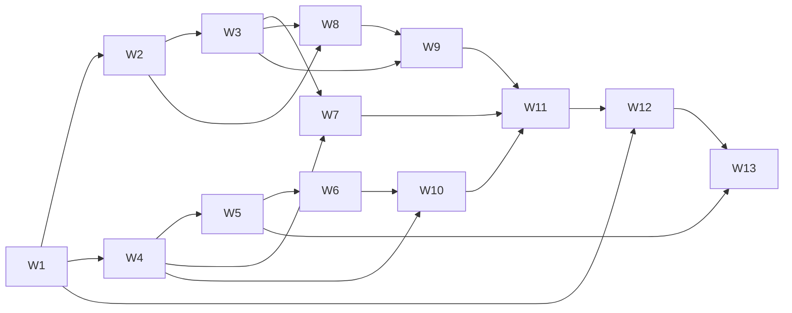

# Phase Plan P3 - Backend real, autenticacion y persistencia

Date: 2026-07-08
Last revised: 2026-07-20
Status: IN PROGRESS - W1-W11 DONE
Phase: `P3`
Source master plan: `docs/plans/astronomy-master-plan.md`
Architecture decision: `docs/adr/0003-backend-auth-apod-stack.md`
Flow overview: `docs/architecture/p3-flow-overview.md`

## 1. Goal

Reemplazar mock y localStorage por un backend ASP.NET Core real, autenticacion segura,
catalogo APOD buscable con PostgreSQL, favoritos por usuario y despliegue completo con
costo obligatorio de $0, manteniendo una experiencia accesible en la primera visita.

## 2. Non-negotiable decisions

1. Identity gestiona passwords, email confirmation y usuarios.
2. Search deriva exclusivamente de `title + explanation`; no usa metadata de keywords.
3. Search usa PostgreSQL FTS sobre `title + explanation`; W6 no habilita `pg_trgm`
   porque las pruebas parciales/typos no justifican una segunda politica de ranking.
4. El DTO app-owned omite `service_version`, normaliza opcionales a `null` y conserva
   nombres JSON snake_case.
5. Confirmacion: link Angular con `userId + code`; mutacion por
   `POST /auth/confirm-email`.
6. Produccion usa proxy same-origin Netlify -> Render; cookie refresh
   `Secure`, `HttpOnly`, `SameSite=Lax`, host-only y `Path=/auth`.
7. Refresh/logout validan `Origin`; interceptor single-flight y retry maximo una vez.
8. Ingestion historica es CLI manual, por lotes y resumible; nunca corre en Render.
9. Ninguna automatizacion o degradacion puede generar cargos.
10. Persistencia se valida con PostgreSQL real mediante Testcontainers.

## 3. Scope

### Included

- Solucion .NET 10, EF Core/Npgsql, Identity, OpenAPI, health y ProblemDetails.
- Entidades `ApplicationUser`, `RefreshSession`, `ApodEntry`, `Favorite` y
  `CatalogSyncState`.
- Registro, reenvio, confirmacion, login, JWT, refresh rotation/reuse y logout.
- Rate limiting de auth/email.
- NASA APOD `today`, `date`, cache en memoria + PostgreSQL.
- Catalog CLI con rangos NASA, checkpoint, resume, retry/backoff y status.
- Search FTS paginado; `pg_trgm` descartado por W6 salvo nueva evidencia futura.
- Favorites protegidos e hidratados mediante un unico join/proyeccion, ordenado por fecha
  descendente y filtrado por el claim JWT `sub`; W11 carga la coleccion completa de la
  sesion autenticada sin introducir un limite silencioso.
- `POST /api/favorites` acepta solo `{ apod_date }`, valida la fecha antes de cache/NASA
  y responde `204` tanto para alta como repeticion; `DELETE /api/favorites/{date}`
  responde `204` tanto para existente como ausente. Ambos derivan el GUID solo de `sub`.
- Frontend auth, bootstrap, guard, single-flight interceptor y estados accesibles.
- Home/Explorer/Search por HTTP; `availableDates` y chips eliminados.
- DatePicker real `<input type="date" min="1995-06-16" max="hoy">`.
- Favorites por API; localStorage deja de ser fuente runtime.
- Docker local y deploy Netlify/Render/Neon/Resend con runbook de costo cero.

### Excluded

- OAuth/social login, password recovery, roles/admin UI.
- Tags generados por NASA o por IA.
- Blobs de imagen/video en PostgreSQL.
- Schedulers, keepalive o servicios pagos.
- Garantia always-on; Render Free puede tener cold start.
- Actualizacion automatica completa del catalogo cada dia.

## 4. Dependencies and gates

- P2 debe estar `DONE` en produccion con evidencia de smoke.
- ADR-0003 y esta planificacion deben permanecer sincronizados.
- W1-W12 se acumulan en `codex/p3-integration`; `main` conserva P2 productivo hasta la
  promocion validada por W13.
- W1-W12 pueden implementarse con servicios locales/mocks.
- Neon es requerido para ejecutar el seed productivo de W5 y W13.
- Resend + dominio verificado son requeridos para smoke real de W13, no para tests W2.
- NASA API key propia es requerida antes del backfill W5; `DEMO_KEY` no se usa en carga.
- Render y URLs finales son requeridos solo en W13.
- Gate Angular previo a W8 cerrado el 2026-07-20 en la rama dedicada
  `maintenance/angular-22-security-update`: Angular 22.0.7, TypeScript 6.0.3 y audit
  runtime sin vulnerabilidades. Los futuros majors requieren el mismo tratamiento;
  nunca `npm audit fix --force` dentro de una wave funcional.

## 5. Requirements checklist

- [x] **R3.1** Foundation y schema PostgreSQL (W1).
- [x] **R3.2** Registro, email y confirmacion segura (W2).
- [x] **R3.3** Login, JWT y refresh sessions robustas (W3).
- [x] **R3.4** NASA today/date + cache + DTO app-owned (W4).
- [x] **R3.5** Catalog CLI resumible y status observable (W5).
- [x] **R3.6** PostgreSQL FTS y endpoint search (W6).
- [x] **R3.7** Favorites API protegida e hidratada (W7).
- [x] **R3.8** Frontend account/auth flows (W8).
- [x] **R3.9** Frontend session bootstrap/guard/interceptor (W9).
- [x] **R3.10** Frontend APOD/date/search migration (W10).
- [x] **R3.11** Frontend favorites migration (W11).
- [ ] **R3.12** Contenedores y stack local (W12).
- [ ] **R3.13** Seed, deploy $0 y smoke productivo (W13).

W1 se cerro el 2026-07-17 con build limpio, migracion inicial reproducible y 11/11
tests Testcontainers sobre PostgreSQL 17. La evidencia y las precisiones fisicas del
schema viven en la wave W1 y ADR-0003.

W2 se cerro el 2026-07-17 con 13/13 tests Account y 24/24 backend PASS. Registro,
reenvio y confirmacion usan respuestas anti-enumeracion, Base64URL y sender fake; el
key ring Identity sobrevive reinicios mediante PostgreSQL. W13 conserva los gates de
proxy confiable para IP real y proteccion en reposo del XML de Data Protection.

W3 se cerro el 2026-07-17 con 23/23 tests Sessions y 47/47 backend PASS. Login usa
Identity con hash dummy anti-timing y JWT HS256 corto. Refresh/logout se serializan con
advisory lock familiar; replay revoca la familia, logout es idempotente y ambos exigen
Origin exacto en Production.

W4 se cerro el 2026-07-17 con 31/31 tests W4 y 78/78 backend PASS. Los endpoints
publicos today/date exponen solo el DTO app-owned; cache acotada y single-flight leen
memoria -> PostgreSQL -> NASA y persisten misses con upsert atomico. La key viaja en
`X-Api-Key`, redirects/429 no se reintentan y ninguna prueba consume NASA real.

W5 se cerro el 2026-07-17 con 55/55 Catalog y 132/132 backend PASS. El CLI local
valida/dry-run antes de dependencias, bloquea Render y exige key personal. Un lock
advisory global con heartbeat excluye rangos solapados. Cada batch acepta el archivo
historico disperso y confirma upserts + checkpoint + synced count en una transaccion.
429 persiste `retry_not_before`; el status usa el target canónico configurado y compara
su cobertura real contra la cantidad sincronizada antes de declarar `ready`.

W6 se cerro el 2026-07-20 con 18/18 tests focalizados y 150/150 backend PASS sobre
PostgreSQL 17. Search usa `websearch_to_tsquery` parametrizado, vector ponderado/GIN,
ranking por relevancia y fecha, DTO array, `q` max 200, page 1..1000 y pageSize 1..30.
Readiness queda
centralizado entre status/search; target ausente, incompleto o con drift responde 503
sin llamar NASA. Stemming cubre variantes inglesas y la evidencia parcial/typo no
justifico `pg_trgm`.

W7 se cerro el 2026-07-20 con 9/9 tests Favorites focalizados y 159/159 backend PASS
sobre PostgreSQL 17 Testcontainers. El contrato protege
`/api/favorites` con JWT, usa el `sub` literal (sin `NameIdentifier` porque
`MapInboundClaims=false`), reutiliza `ApodCacheService` para misses y ejecuta el insert
idempotente `ON CONFLICT DO NOTHING`. GET proyecta cards hidratadas en un unico join;
los tests focalizados cubren 401, principal `sub` malformado, fecha invalida antes de
NASA, fallo APOD sanitizado, concurrencia, aislamiento y una sola lectura SQL. Build
Release, review independiente, `dotnet format --verify-no-changes` y `git diff --check`
tambien PASS.

W8 se cerro el 2026-07-20 con `AuthService` tipado en signals, formularios standalone
lazy de registro/login/confirmacion y `provideHttpClient()`. Todo request de cuenta usa
solo `/auth/*` same-origin; el JWT de login queda exclusivamente en memoria, mientras
ProblemDetails conserva contrato tipado y la UI muestra 401 generico o CTA unicamente
para `403 email_unconfirmed`. La confirmacion valida GUID + Base64URL antes de limpiar
el codigo de la historia y ejecutar solo `POST`, incluso ante fallo, y redirige a login
sin auto-login. W8 no
introduce environment de URL backend, guard, interceptor, refresh ni logout: W9 extiende
el servicio para esos limites. `npm run build` y 94/94 pruebas ChromeHeadless PASS.

W9 se cerro el 2026-07-20 con bootstrap de refresh una vez por vida de la SPA y estados
`checking/auth/anon`, guard de `/favorites`, interceptor Bearer limitado a rutas relativas
`/api/*`, refresh single-flight y un unico retry interno. Los endpoints `/auth/*` y URLs
externas no reciben Bearer ni auto-refresh. Un refresh fallido limpia el estado y redirige
una vez, mientras que el bootstrap anonimo no redirige; logout limpia memoria antes del
POST best-effort. El proxy Angular dirige `/api` y `/auth` a `http://localhost:5179` sin
CORS ni URL Render en browser. `AuthService.sessionChange` deja un contrato explicito
para que W11 limpie favoritos al logout/cambio de usuario. Login solo acepta un
`returnUrl` interno normalizado. La generacion de sesion asociada al Bearer evita que un
refresh viejo reintente, borre o redirija una cuenta creada despues de logout. `npm run
build` y 110/110 pruebas ChromeHeadless PASS.

W10 se cerro el 2026-07-20 con la migracion completa de APOD frontend. El DTO Angular
es el contrato app-owned de ocho campos snake_case, sin `service_version` y con nulos
normalizados. `/` redirige a `/home`; Home consume `today`, Explorer consume fecha real
y search paginado, y no queda import/runtime asset de `apod.json` ni `availableDates`.
`switchMap` cancela date/search obsoletos; `requestedDate` es la seleccion valida en
curso y `selectedDate` se confirma solo desde la respuesta APOD. Los estados accesibles
cubren loading, upstream/cold-start, empty y `catalog_not_ready` con Retry. La fachada
local P2 de favoritos es transitoria y W11 la elimina sin migracion silenciosa. `npm run
build` y 100/100 pruebas ChromeHeadless PASS.

W11 se cerro el 2026-07-20 con `FavoritesService` autenticado. Una coleccion hidratada
se carga una vez por usuario/sesion mediante `GET /api/favorites`, sin N+1 ni limite
silencioso. Add usa exactamente `POST /api/favorites` con `{ "apod_date": date }` y
delete `DELETE /api/favorites/{date}`; ambos esperan 204, bloquean acciones duplicadas
por fecha y manejan error/retry accesible. El servicio escucha `sessionChange` y
`currentUser`, cancela/ignora respuestas viejas y borra toda memoria al logout o cambio
de cuenta. La comparacion directa de usuario en lecturas/callbacks bloquea el intervalo
antes de que se ejecute el effect Angular y la signal de identidad activa invalida cualquier
valor publico cacheado. Los corazones anonimos ofrecen login con
retorno interno normalizado. No queda
lectura, escritura ni migracion de `ape.favorites.v1`. `npm ci`, `npm run build`,
115/115 pruebas ChromeHeadless, `npm audit --omit=dev` (0 runtime) y `git diff --check`
PASS.

## 6. Exit criteria

P3 es `DONE` solo con evidencia de todos los puntos:

- `dotnet build backend/AstronomyExplorer.sln` PASS.
- `dotnet test backend/AstronomyExplorer.sln` PASS, incluyendo Testcontainers.
- `npm run build` y ChromeHeadless tests PASS.
- `docker compose up -d --build` levanta frontend, API y PostgreSQL; health PASS.
- Migraciones aplican localmente y en Neon.
- Catalog seed completa cobertura `1995-06-16..fecha objetivo`, puede reanudarse y
  `catalog-status` queda ready.
- Search prueba ranking de title sobre explanation, paginacion, vacio, caracteres
  especiales y fallback trigram solo si fue habilitado.
- Auth E2E: register -> email -> confirm POST -> login -> bootstrap/refresh -> logout.
- Confirmacion requiere `userId + code`; el codigo queda Base64URL y no persiste raw.
- Refresh concurrente produce una sola rotacion desde Angular; replay revoca familia.
- Requests refresh/logout con `Origin` no permitido fallan.
- Favorites E2E prueba aislamiento de dos usuarios y listado sin N+1.
- Frontend no importa `apod.json`, no usa `availableDates`, no persiste tokens y no usa
  `ape.favorites.v1` como fuente runtime.
- Netlify proxifica `/api/*` y `/auth/*` antes del fallback SPA.
- Produccion usa exclusivamente planes $0; no hay keepalive, cron u overages pagos.
- Primera visita durante cold start muestra estado comprensible y permite retry.
- Runbook registra fecha, URLs, cuotas, configuracion de gasto cero y smoke completo.
- PRD, ADR, readiness, master, phase, flow y waves quedan sincronizados.

## 7. Wave split

1. `astronomy-p3-w1-backend-foundation-wave.md`
2. `astronomy-p3-w2-account-email-wave.md`
3. `astronomy-p3-w3-auth-sessions-wave.md`
4. `astronomy-p3-w4-nasa-apod-cache-wave.md`
5. `astronomy-p3-w5-catalog-ingestion-wave.md`
6. `astronomy-p3-w6-apod-search-wave.md`
7. `astronomy-p3-w7-favorites-api-wave.md`
8. `astronomy-p3-w8-frontend-account-auth-wave.md`
9. `astronomy-p3-w9-frontend-session-wave.md`
10. `astronomy-p3-w10-frontend-apod-search-wave.md`
11. `astronomy-p3-w11-frontend-favorites-wave.md`
12. `astronomy-p3-w12-local-containers-wave.md`
13. `astronomy-p3-w13-zero-cost-deploy-wave.md`

All files live under `docs/plans/waves/`.

## 8. Dependency graph



- W2 y W4 pueden ejecutarse en paralelo despues de W1 si el scope de `Program.cs` se
  coordina o se integran secuencialmente en `main`.
- No se paralelizan waves que compartan servicios Angular centrales.
- W13 es la unica wave autorizada a mutar proveedores productivos.

## 9. Phase verification

```powershell
dotnet build backend/AstronomyExplorer.sln
dotnet test backend/AstronomyExplorer.sln
npm run build
npm test -- --watch=false --browsers=ChromeHeadless
docker compose config
docker compose up -d --build
Invoke-WebRequest http://localhost:<api-port>/health
docker compose down
```

El seed y smoke productivo usan comandos exactos documentados por W5/W13 cuando existan
los recursos externos; no se consideran verificados mediante afirmaciones manuales sin
fecha y resultado.
