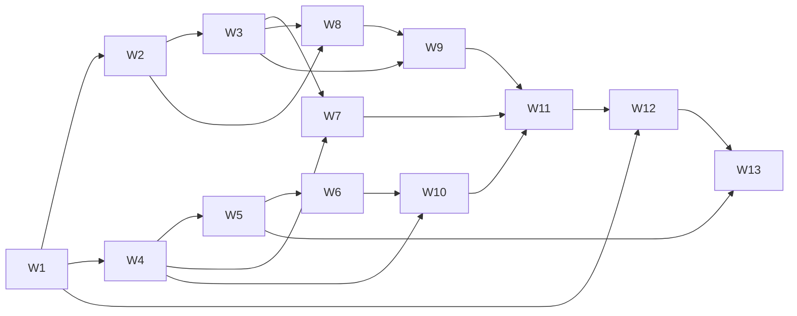

# Phase Plan P3 - Backend real, autenticacion y persistencia

Date: 2026-07-08
Last revised: 2026-07-16
Status: READY FOR IMPLEMENTATION - Not Started
Phase: `P3`
Source master plan: `docs/plans/astronomy-master-plan.md`
Architecture decision: `docs/adr/0003-backend-auth-apod-stack.md`
Flow overview: `docs/architecture/p3-flow-overview.md`

## 1. Goal

Reemplazar mock y localStorage por un backend ASP.NET Core real, autenticacion segura,
catalogo APOD buscable con PostgreSQL, favoritos por usuario y despliegue completo con
costo obligatorio de $0, manteniendo una experiencia accesible en la primera visita.

## 2. Non-negotiable decisions

1. Identity gestiona passwords, email confirmation y usuarios.
2. Search deriva exclusivamente de `title + explanation`; no usa metadata de keywords.
3. Search usa PostgreSQL FTS sobre `title + explanation`; `pg_trgm` es fallback opcional.
4. El DTO app-owned omite `service_version`, normaliza opcionales a `null` y conserva
   nombres JSON snake_case.
5. Confirmacion: link Angular con `userId + code`; mutacion por
   `POST /auth/confirm-email`.
6. Produccion usa proxy same-origin Netlify -> Render; cookie refresh
   `Secure`, `HttpOnly`, `SameSite=Lax`, host-only y `Path=/auth`.
7. Refresh/logout validan `Origin`; interceptor single-flight y retry maximo una vez.
8. Ingestion historica es CLI manual, por lotes y resumible; nunca corre en Render.
9. Ninguna automatizacion o degradacion puede generar cargos.
10. Persistencia se valida con PostgreSQL real mediante Testcontainers.

## 3. Scope

### Included

- Solucion .NET 10, EF Core/Npgsql, Identity, OpenAPI, health y ProblemDetails.
- Entidades `ApplicationUser`, `RefreshSession`, `ApodEntry`, `Favorite` y
  `CatalogSyncState`.
- Registro, reenvio, confirmacion, login, JWT, refresh rotation/reuse y logout.
- Rate limiting de auth/email.
- NASA APOD `today`, `date`, cache en memoria + PostgreSQL.
- Catalog CLI con rangos NASA, checkpoint, resume, retry/backoff y status.
- Search FTS paginado; trigram opcional sujeto a evidencia.
- Favorites protegidos e hidratados.
- Frontend auth, bootstrap, guard, single-flight interceptor y estados accesibles.
- Home/Explorer/Search por HTTP; `availableDates` y chips eliminados.
- DatePicker real `<input type="date" min="1995-06-16" max="hoy">`.
- Favorites por API; localStorage deja de ser fuente runtime.
- Docker local y deploy Netlify/Render/Neon/Resend con runbook de costo cero.

### Excluded

- OAuth/social login, password recovery, roles/admin UI.
- Tags generados por NASA o por IA.
- Blobs de imagen/video en PostgreSQL.
- Schedulers, keepalive o servicios pagos.
- Garantia always-on; Render Free puede tener cold start.
- Actualizacion automatica completa del catalogo cada dia.

## 4. Dependencies and gates

- P2 debe estar `DONE` en produccion con evidencia de smoke.
- ADR-0003 y esta planificacion deben permanecer sincronizados.
- W1-W12 pueden implementarse con servicios locales/mocks.
- Neon es requerido para ejecutar el seed productivo de W5 y W13.
- Resend + dominio verificado son requeridos para smoke real de W13, no para tests W2.
- NASA API key propia es requerida antes del backfill W5; `DEMO_KEY` no se usa en carga.
- Render y URLs finales son requeridos solo en W13.

## 5. Requirements checklist

- [ ] **R3.1** Foundation y schema PostgreSQL (W1).
- [ ] **R3.2** Registro, email y confirmacion segura (W2).
- [ ] **R3.3** Login, JWT y refresh sessions robustas (W3).
- [ ] **R3.4** NASA today/date + cache + DTO app-owned (W4).
- [ ] **R3.5** Catalog CLI resumible y status observable (W5).
- [ ] **R3.6** PostgreSQL FTS y endpoint search (W6).
- [ ] **R3.7** Favorites API protegida e hidratada (W7).
- [ ] **R3.8** Frontend account/auth flows (W8).
- [ ] **R3.9** Frontend session bootstrap/guard/interceptor (W9).
- [ ] **R3.10** Frontend APOD/date/search migration (W10).
- [ ] **R3.11** Frontend favorites migration (W11).
- [ ] **R3.12** Contenedores y stack local (W12).
- [ ] **R3.13** Seed, deploy $0 y smoke productivo (W13).

## 6. Exit criteria

P3 es `DONE` solo con evidencia de todos los puntos:

- `dotnet build backend/AstronomyExplorer.sln` PASS.
- `dotnet test backend/AstronomyExplorer.sln` PASS, incluyendo Testcontainers.
- `npm run build` y ChromeHeadless tests PASS.
- `docker compose up -d --build` levanta frontend, API y PostgreSQL; health PASS.
- Migraciones aplican localmente y en Neon.
- Catalog seed completa cobertura `1995-06-16..fecha objetivo`, puede reanudarse y
  `catalog-status` queda ready.
- Search prueba ranking de title sobre explanation, paginacion, vacio, caracteres
  especiales y fallback trigram solo si fue habilitado.
- Auth E2E: register -> email -> confirm POST -> login -> bootstrap/refresh -> logout.
- Confirmacion requiere `userId + code`; el codigo queda Base64URL y no persiste raw.
- Refresh concurrente produce una sola rotacion desde Angular; replay revoca familia.
- Requests refresh/logout con `Origin` no permitido fallan.
- Favorites E2E prueba aislamiento de dos usuarios y listado sin N+1.
- Frontend no importa `apod.json`, no usa `availableDates`, no persiste tokens y no usa
  `ape.favorites.v1` como fuente runtime.
- Netlify proxifica `/api/*` y `/auth/*` antes del fallback SPA.
- Produccion usa exclusivamente planes $0; no hay keepalive, cron u overages pagos.
- Primera visita durante cold start muestra estado comprensible y permite retry.
- Runbook registra fecha, URLs, cuotas, configuracion de gasto cero y smoke completo.
- PRD, ADR, readiness, master, phase, flow y waves quedan sincronizados.

## 7. Wave split

1. `astronomy-p3-w1-backend-foundation-wave.md`
2. `astronomy-p3-w2-account-email-wave.md`
3. `astronomy-p3-w3-auth-sessions-wave.md`
4. `astronomy-p3-w4-nasa-apod-cache-wave.md`
5. `astronomy-p3-w5-catalog-ingestion-wave.md`
6. `astronomy-p3-w6-apod-search-wave.md`
7. `astronomy-p3-w7-favorites-api-wave.md`
8. `astronomy-p3-w8-frontend-account-auth-wave.md`
9. `astronomy-p3-w9-frontend-session-wave.md`
10. `astronomy-p3-w10-frontend-apod-search-wave.md`
11. `astronomy-p3-w11-frontend-favorites-wave.md`
12. `astronomy-p3-w12-local-containers-wave.md`
13. `astronomy-p3-w13-zero-cost-deploy-wave.md`

All files live under `docs/plans/waves/`.

## 8. Dependency graph



- W2 y W4 pueden ejecutarse en paralelo despues de W1 si el scope de `Program.cs` se
  coordina o se integran secuencialmente en `main`.
- No se paralelizan waves que compartan servicios Angular centrales.
- W13 es la unica wave autorizada a mutar proveedores productivos.

## 9. Phase verification

```powershell
dotnet build backend/AstronomyExplorer.sln
dotnet test backend/AstronomyExplorer.sln
npm run build
npm test -- --watch=false --browsers=ChromeHeadless
docker compose config
docker compose up -d --build
Invoke-WebRequest http://localhost:<api-port>/health
docker compose down
```

El seed y smoke productivo usan comandos exactos documentados por W5/W13 cuando existan
los recursos externos; no se consideran verificados mediante afirmaciones manuales sin
fecha y resultado.
